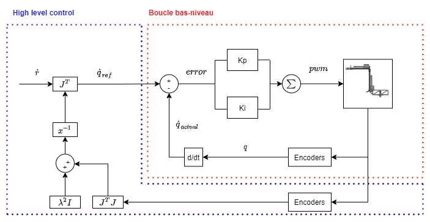

# Files descritption
The following subsections will give a brief summary of each file and its role.

#### arm_class.py
Python class for the arm. This class has the following methods:

- ```__init()__``` : Initialises class attributes such as the robot's DOFS (degrees of freedom), link lengths and DH parameters. A DynamicReconfigure server is created for the lambda gain of the speed control loop in order to let the user modify its value in real-time via the user interface. 
- ``` dynamic_reconfigure_callback(config, level)```: Callback of the DynamicReconfigure server that updates the variable's value when changed by the user.
- ``` dh2T(r, d, theta, alpha)```: Computes a transformation matrix based on DH parameters passed as argument.
- ``` dhs2T(r, d, theta, alpha)```: Computes a transformation matrix for a list of DH parameters. This function can compute the transformation matrix from the end effector's referential to the robot's base referntial. The DH parameters passed to the function must be in a list and in order from base referential to end-effector referential.
- ``` forward_kinematics()```: Extracts end-effector pose from the transformation matrix given by the dhs2T method.
- ``` jacobian_matrix()```: Computes the Jacobian matrix of the robot using its current configuration.
- ``` get_joint_config()```: Returns robot's joint configuration.
- ``` get_effector_pos()```: Returns end-effector's pose
- ``` speed_controller()```: Computes joint velocity commands from cartesian commands using the inverse kinematic differential equation with speed regulation for singularity avoidance.

This fugre presents the control architecture on the real arm 


#### arm_node.py
Python script that acts as a ROS node and handles the inputs and outputs of the arm's class. This node class has an instance of the arm's class as an attribute and has the following methods:
- ```__init__() ```: Subscribes to the ```/zeus_arm/cmd_vel``` and ```/zeus_arm/joint_states``` topics and advertises the ```/zeus_arm/joint_cmds``` topic. This function also creates a 50 Hz timer with its callback set to the ```speed_controller()```. The timer serves as the high-level controol loop that publishes joint commands periodically.
  - The ```/zeus_arm/cmd_vel``` topic receives the command generated by the Xbox controller via a custom ROS message that contains the current control mode of the arm (int) and a twist command.
  - The ```/zeus_arm/joint_states``` topic receives a ```Float64Multiarray``` message that contains each joint's current position. 
  - The ```/zeus_arm/joint_cmds``` topic receives a ```Float64Multiarray``` message that contains each joint velocity command.
- ```speed_controller(event)```: Timer callback. If control mode is set to cartesian mode, it calls the robot's class ```speed_controller()``` method and then calls the ```send_cmd()``` method to send the joint commands. If control mode is set to joint mode, it bypasses the high-level control loop and directly sends joint commands.
- ```send_cmd(cmd)```: Publishes command passed as argument to ```/zeus_arm/joint_cmds``` topic.
- ```set_cmd(smd)```: ```/zeus_arm/cmd_vel``` callback. 
  - If control mode is set to cartesian, this function sets the ```ref_cmd``` attribute of the robot's class that is used in the inverse kinematic differential equation.
  - If control mode is set to joint, this function sets the command to send as the command received by the Xbox controller.
- ```update_joint_states(msg)```:

#### arm_node_test.py
Same as ```arm_node.py``` but mainly used for development tests.

#### init_robot.py
Pyhton scripts that sets gravity to 0 in Gazebo and unpauses the simulation.

#### pos_teleop.py
Node class that handles the Xbox controler inputs and converts them to twist messages. This class has the following methods : 
- ```__init__()```: Subscribes to ```/joy_arm``` node and advertises the ```/zeus_arm/cmd_vel``` topic. A DynamicReconfigure server is created for the desired cartesian speed so that the user may modify this value via the user interface. This function also creates a 50 Hz to publish cartesian commands periodically.
  - ```/joy_arm``` topic receives a joy message with all the inputs activated on the Xbox controller.
  - ```/zeus_arm/cmd_vel``` topic receives the command generated by the Xbox controller via a custom ROS message that contains the current control mode of the arm (int) and a twist command.  
- ``` dynamic_reconfigure_callback(config, level)```: Callback of the DynamicReconfigure server that updates the variable's value when changed by the user.
- ```change_joint(direction)```: Changes the current joint being control while control mode is set to joint control.
- ```change_mode()```: Changes arm control mode.
- ```print_joint()```: Prints current controlled joint.
- ```print_mode()```: Prints current control mode.
- ```joy_callback(msg)```: Creates command message to publish on ```/zeus_arm/cmd_vel``` depending on the current control mode.
- ```send_cmd()```: Publishes command on ```/zeus_arm/cmd_vel``` topic.
- ```send_cmd_callback(msg)```: Function called at 50 Hz to publish cartesian commands.

#### pos_teleop_test.py
Same as ```pos_teleop.py``` but mainly used for development tests.
#### test_fk.py
Python script that tests the jacobian and forward kinematic methods of the robot's class.
